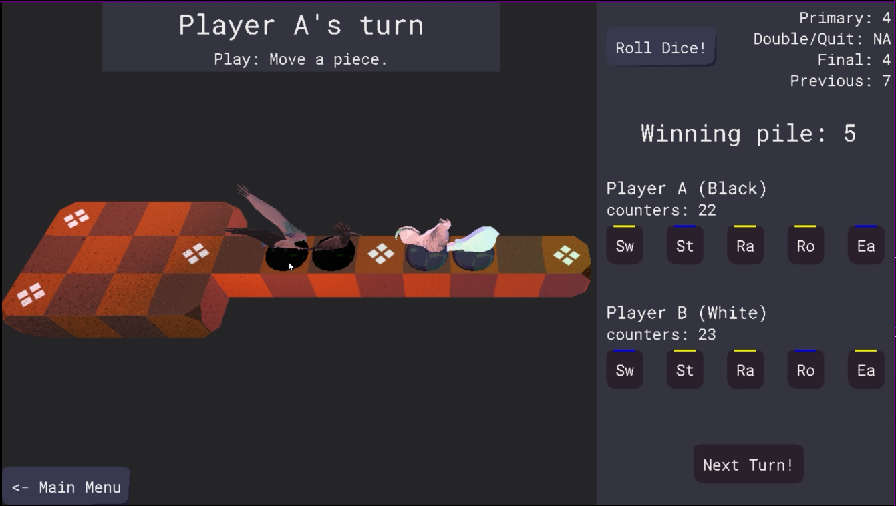
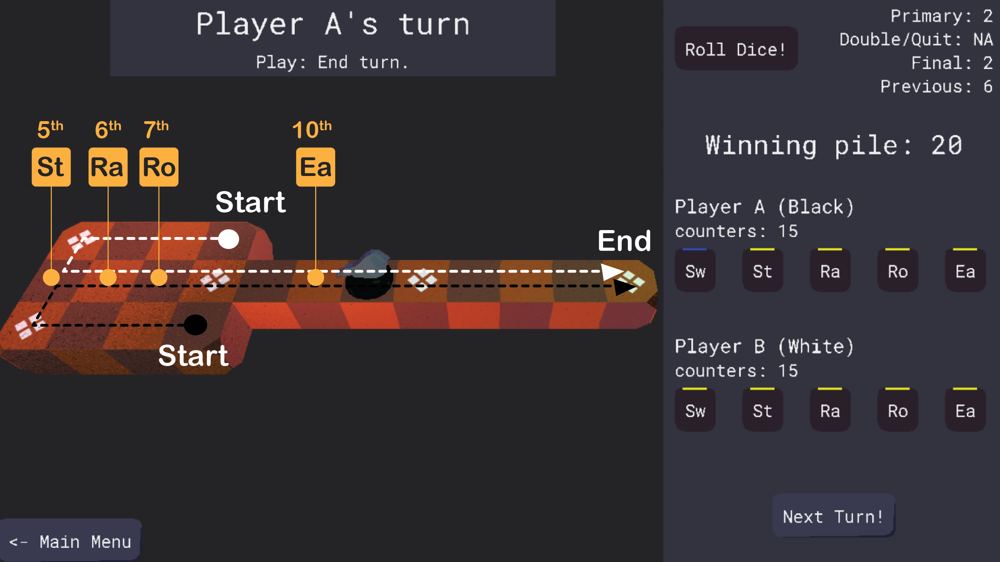
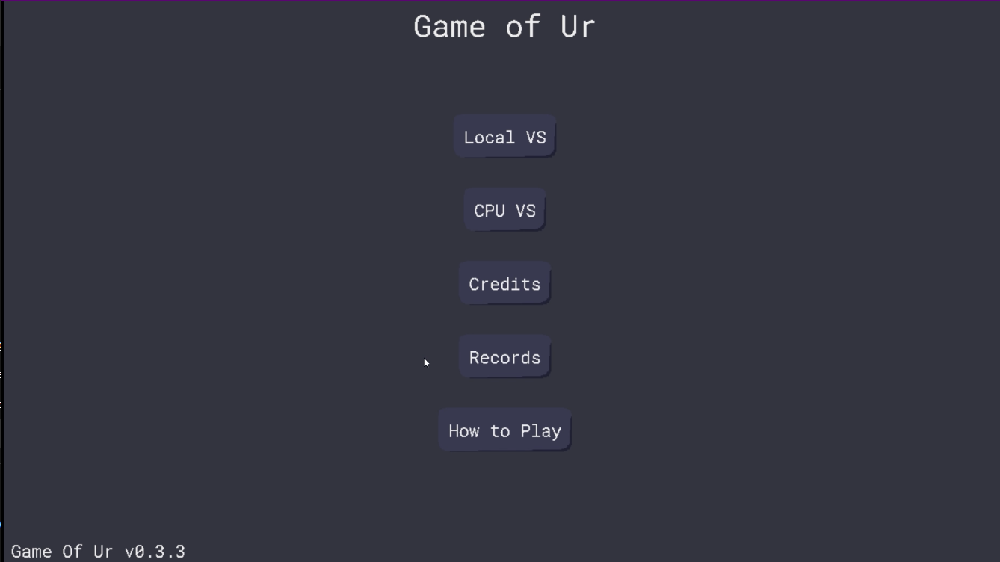

# Game of Ur Project

## Project Description

### Introduction

This is a computer adaptation of [Game of Ur](https://en.wikipedia.org/wiki/Royal_Game_of_Ur), written in C++ mainly using SDL and OpenGL, and built
on top of the [ToyMaker game engine.](https://github.com/raynmetal/toymaker)

Game of Ur is a competitive, two-player board game. The player who moves all 5 of their pieces to the end of the course first, wins the game.  The variant
implemented in this adaptation is based on a paper by Irving Finkel.  See the [game design document](docs/game_design_doc.md) for more information.







### Documentation

Documentation for this game and its engine is available on this project's [github pages](https://raynmetal.github.io/game-of-ur/index.html).

### Motivation

I spent 2023-2024 studying C++, OpenGL, SDL, and 3D graphics by following the tutorials on [learncpp](https://www.learncpp.com/), [Lazy Foo](https://lazyfoo.net), and [Learn OpenGL](https://learnopengl.com/) among others. With this project, I hope to both cement and demonstrate my newly acquired skills.

I decided against making an original game because I wanted to focus on the technical aspects of game development, and not on game design. Adapting an existing game seemed like a good way to limit the scope of my first project.

## Installation

### On Debian (Linux)

> [!CAUTION]
>
> This game requires packages that are only available on the ["sid"/unstable]()
> distribution of Debian.  Instructions for installing those packages go beyond the
> scope of this document.
>
> Until those packages make it to one of the mainstream Debian distributions, it would
> be preferrable to build Game of Ur and its dependencies from source.  Instructions for
> the former can be found under section "Building from source."

1. Follow the instructions [here](https://www.github.com/raynmetal/toymaker#on-debian-linux)
to install the ToyMaker package, which Game of Ur depends on.

2. Unpack the latest Debian build of the game (ending in `.deb`).

```bash
sudo apt install ./game-of-ur_0.4.2_amd64.deb
```

3. Run the game.

```bash
game-of-ur
```

### On Arch (Linux)

The installation process here is identical to the one for [installing AUR packages.](https://wiki.archlinux.org/title/Arch_User_Repository)

1. Follow the instructions [here](https://github.com/raynmetal/toymaker#on-arch-linux) to install the ToyMaker package, which
Game of Ur depends on.

2. Unpack the latest Arch build of the game, [downloaded from here.](https://github.com/raynmetal/game-of-ur/releases/tag/v0.4.1)

```bash
tar -xvf game-of-ur-0.4.1-x86_64-arch.tar.gz
```

3. Now enter the `game-of-ur` package directory.

```bash
cd ../game-of-ur-0.4.1-x86_64-arch
```

4. Run `makepkg` to build the game-of-ur package.  On success, this should produce a file
named `game-of-ur-0.4.1-1-x86_64.pkg.tar.zst`.

```bash
makepkg
```

5. Use `pacman` to install the package.

```bash
pacman -U game-of-ur-0.4.1-1-x86_64.pkg.tar.zst
```

6. Run the game.

```bash
game-of-ur
```

### ~On Windows~

WIP.

## Building from source

### Requirements

This project uses [CMake](https://cmake.org/) for its build system, so make sure to have that installed.

On your platform, download the following packages and place them somewhere discoverable by your compiler toolchain.

- [MinGW-w64](https://www.mingw-w64.org/) -- For the C++ standard library headers, and for the compiler toolchain for building native Windows applications.

- [SDL](https://www.libsdl.org/) -- For abstracting away platform specific tasks, like requesting a window for the application.

- [SDL Image](https://github.com/libsdl-org/SDL_image) -- For loading of images in various formats.

- [SDL TTF](https://github.com/libsdl-org/SDL_ttf) -- For loading and rendering fonts.

- [GLEW](https://github.com/nigels-com/glew) -- For exposing OpenGL functionality available on this platform.

- [Nlohmann JSON](https://json.nlohmann.me/) -- For serialization/deserialization of data to and from JSON.

- [GLM](https://github.com/g-truc/glm) -- For linear algebra functions resembling those in GLSL, and for quaternion math.

- [Assimp](https://github.com/assimp/assimp) -- For importing assets of various kinds, mainly 3D models.

- [ToyMaker](https://github.com/raynmetal/toymaker) -- For the engine/framework this game is built on.

If you'd like to generate and tinker with the documentation generated for the project, also install [Doxygen](https://www.doxygen.nl/).

Finally, [clone this repository,](https://github.com/raynmetal/game-of-ur) or download its snapshot.

### Compiling

1. Enter the root directory of the project (the same one where README.md and LICENSE.txt are found).

2. Run `cmake . -B build/ -DCMAKE_BUILD_TYPE=Debug` to initialize the build directory.

3. Change to the build directory using `cd build`, then run `cmake --build .` to build the Debug version of the project.

4. Run the (debug build of the) game using the generated `Game_Of_Ur.exe` file in the build folder.

## Goals

- [x] Stylized 3D graphics
- [x] Offline multiplayer
- [x] AI opponent
- [x] Music and sound effects
- ~~Tutorialization~~ (I'm very very tired)
- [x] Playable on Windows
- [x] Playable on Linux (Arch, Debian)
- ~~Playable on Android~~ (Maybe some day)
- [ ] Itch.io release
- ~~Play Store release~~ (Maybe a day long after the other days)
- [x] Code Documentation

## Contributing

I'm not planning to accept contributions to this project any time soon.  Feel free to fork the project and make it your own, though!

## LICENSE

raynmetal/game-of-ur is distributed under the terms of the [MIT License](LICENSE.txt).

This program makes extensive use of the following libraries:

- [SDL](https://www.libsdl.org/)
- [SDL Image](https://github.com/libsdl-org/SDL_image)
- [SDL TTF](https://github.com/libsdl-org/SDL_ttf)
- [GLEW](https://github.com/nigels-com/glew)
- [Nlohmann JSON](https://json.nlohmann.me/)
- [GLM](https://github.com/g-truc/glm)
- [Assimp](https://github.com/assimp/assimp)

Along with the following sounds, courtesy [freesound.org](freesound.org):

- Melancholic piano music.mp3 by ZHRØ | License: Creative Commons 0
- box_drag.wav by X3msnake | License: Creative Commons 0
- Teeth clack 1 by hollandm | License: Creative Commons 0
- Door Handle Wood Clack.aif by RutgerMuller | License: Creative Commons 0
- Dice.mp3 by AbdrTar | License: Creative Commons 0

