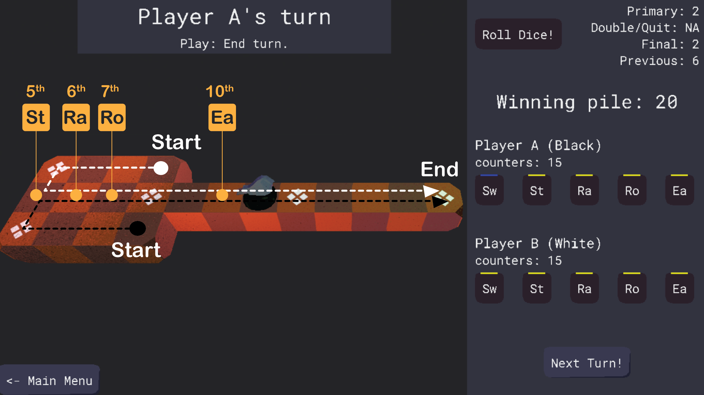

# Game of Ur Project

## Project Description

### Introduction

This is a computer adaptation of [Game of Ur](https://en.wikipedia.org/wiki/Royal_Game_of_Ur), written in C++ mainly using SDL and OpenGL.

Game of Ur is a competitive, two-player board game. The player who moves all 5 of their pieces to the end of the course first, wins the game.  The variant implemented in this adaptation is based on a paper by Irving Finkel.  See the [game design document](docs/game_design_doc.md) for more information.

### Documentation

Documentation for this game and its engine is available on this project's [github pages](https://raynmetal.github.io/game-of-ur/index.html).

### Motivation

I spent 2023-2024 studying C++, OpenGL, SDL, and 3D graphics by following the tutorials on [learncpp](https://www.learncpp.com/), [Lazy Foo](https://lazyfoo.net), and [Learn OpenGL](https://learnopengl.com/) among others. With this project, I hope to both cement and demonstrate my newly acquired skills.

I decided against making an original game because I wanted to focus on the technical aspects of game development, and not on game design. Adapting an existing game seemed like a good way to limit the scope of my first project.

## Installation

Note that at the moment the project is only available on Windows.  I have not yet attempted to run or build it on any other platform.

### Pre-built executable

The latest build of the project can be downloaded from this project's [releases page.](https://github.com/raynmetal/game-of-ur/releases)

Once downloaded, the game zip can be extracted to any location of your choice, and then launched with `Game_Of_Ur.exe`.

### Building from source

#### Requirements

> [!NOTE]
> This application has not been tested with anything other than the Windows MinGW package available via MSYS2's package manager.

This project uses [CMake](https://cmake.org/) for its build system, so make sure to have that installed.

On your platform, download the following packages and place them somewhere discoverable by your compiler toolchain.

- [MinGW-w64](https://www.mingw-w64.org/) -- For the C++ standard library headers, and for the compiler toolchain for building native Windows applications.

- [SDL](https://www.libsdl.org/) -- For abstracting away platform specific tasks, like requesting a window for the application.

- [SDL Image](https://github.com/libsdl-org/SDL_image) -- For loading of images in various formats.

- [SDL TTF](https://github.com/libsdl-org/SDL_ttf) -- For loading and rendering fonts.

- [GLEW](https://github.com/nigels-com/glew) -- For exposing OpenGL functionality available on this platform.

- [Nlohmann JSON](https://json.nlohmann.me/) -- For serialization/deserialization of data to and from JSON.

- [GLM](https://github.com/g-truc/glm) -- For linear algebra functions resembling those in GLSL, and for quaternion math.

- [Assimp](https://github.com/assimp/assimp) -- For importing assets of various kinds, mainly 3D models.

If you'd like to generate and tinker with the documentation generated for the project, also install [Doxygen](https://www.doxygen.nl/).

Finally, [clone this repository,](https://github.com/raynmetal/game-of-ur) or download its snapshot.

#### Compiling

1. Enter the root directory of the project (the same one where README.md and LICENSE.txt are found).

2. Run `cmake . -B build/ -DCMAKE_BUILD_TYPE=Debug` to initialize the build directory.

3. Change to the build directory using `cd build`, then run `cmake --build .` to build the Debug version of the project.

4. Run the (debug build of the) game using the generated `Game_Of_Ur-d.exe` file in the build folder.

## Goals

- [x] Stylized 3D graphics
- [x] Offline multiplayer
- [x] AI opponent
- ~~Music and sound effects~~ (I'm tired)
- ~~Tutorialization~~ (I'm very very tired)
- [x] Playable on Windows
- ~~Playable on Android~~ (Maybe some day)
- [ ] Itch.io release
- ~~Play Store release~~ (Maybe a day long after the other days)
- [x] Code Documentation

## Contributing

I'm not planning to accept contributions to this project any time soon.  Feel free to fork the project and make it your own, though!

## LICENSE

raynmetal/game-of-ur is distributed under the terms of the [MIT License](LICENSE.txt).

This program makes extensive use of the following libraries:

- [SDL](https://www.libsdl.org/)
- [SDL Image](https://github.com/libsdl-org/SDL_image)
- [SDL TTF](https://github.com/libsdl-org/SDL_ttf)
- [GLEW](https://github.com/nigels-com/glew)
- [Nlohmann JSON](https://json.nlohmann.me/)
- [GLM](https://github.com/g-truc/glm)
- [Assimp](https://github.com/assimp/assimp)
