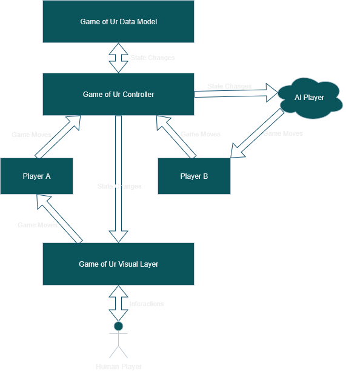

# Game of Ur: Visual and Interaction Layer

## What is it?

The visual and interaction layer is a collection of scenes and aspects implemented on ToyMaker for the purpose of providing visual feedback to the player playing the game on this platform, and also allowing them to interact with the game.  

It is not a system per-se, and is more a catch all term for everything that makes up the game not already covered by other systems.

## Important components

### Scenes and configs

- data/input_bindings.json -- The input bindings for game controls.

- data/ur_3d.json, data/ur_ui.json, and data/ur_ui_player_panel.json -- The scene files for the game world and UI for the app view where the game is actually played.

- data/ur_main_menu.json, data/ur_credits.json, data/ur_records_browser.json, data/ur_tutorials_browser.json -- The various menus available to a player at the start of the game.

- data/ur_tutorials.json -- The content for every page of the tutorial written for the game.

- data/ur_button.json -- The button asset used in several parts of the game UI.

### Classes

- IUsePointer, ILeftClickable, and IUsePointer -- The interfaces extended by objects wishing to take part in pointer-related events.

- QueryClick -- A ToyMaker::SimObjectAspect extending IUsePointer, which projects raycasts and invokes pointer callbacks on their results in response to pointer events.

- UIPanel -- An aspect responsible for managing and resizing panel textures to fit the needs of whatever UI it is a part of.

- UIText -- An aspect responsible for generating text textures for the UI.

- UIButton -- The aspect in control of the button asset, displaying buttons state updates and providing button-related signals.

- UrUITutorialsBrowser, UrUIRecordsBrowser, UrUIView, UrSceneView -- Aspects responsible for managing a subset of the views available in-game.

- UrLookAtBoard -- A hacky utility class for keeping the game board centered in the 3D game view.

- BoardLocations -- A class that translates pointer clicks on the 3D model of the game board to their data model coordinates, and vice-versa.

## Why does it exist?

It exists to allow the game to be interacted with, and to visually represent the current state of the game.  There wouldn't be a game without it.
